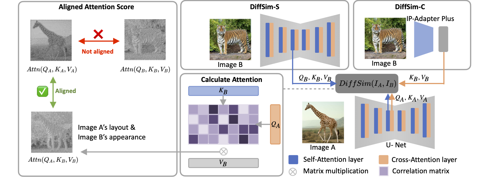

<p align="center">

  <h2 align="center">DiffSim: Taming Diffusion Models for Evaluating Visual Similarity</h2>
  <p align="center">
    <a href="https://scholar.google.com/citations?user=L2YS0jgAAAAJ&hl=en"><strong>Yiren Song</strong></a>
    ·
    <a href="https://scholar.google.com/citations?user=dAEHm8AAAAAJ&hl=en"><strong>Xiaokang Liu</strong></a>
    ·
    <a href="https://sites.google.com/view/showlab"><strong>Mike Zheng Shou</strong></a>
    <br>
    <br>
        <a href="https://arxiv.org/abs/2412.14580"></a>
        <!-- <a href='https://showlab.github.io/magicanimate'></a> -->
        <!-- <a href='https://huggingface.co/spaces/zcxu-eric/magicanimate'></a> -->
    <br>
    <b>National University of Singapore</b>
  </p>
  
  <table align="center">
    <tr>
    <td>
      
    </td>
    </tr>
  </table>

## 📢 News
* **[Jun.26.2025]** DiffSim is accepted to ICCV 2025 🍀.
* **[Dec.19.2024]** Release DiffSim paper and source codes.

## Preparation

### Dataset / Benchmarks Download

Please download any of the 7 benchmarks below for evaluation:

#### Sref

Sref is a benchmark we propose. We have collected 508 styles, each hand-picked by human artists and featuring four thematically distinct reference images, created using Midjourney’s Sref mode. Midjourney’s style reference feature allows users to guide the style or aesthetic of generated images by using external pictures or style seeds in their prompt.

Please download the benchmark at [here](https://huggingface.co/datasets/yiren98/Sref).

#### IP

IP is a benchmark we propose. We have collected images of 299 IP characters and used advanced Flux models and the IP-Adapter to create several variants of each character with different consistency weights.

Please download the benchmark at [here](https://huggingface.co/datasets/yiren98/IPref/tree/main).

#### CUTE

#### NIGHTS

#### InstantStyle

#### TID2013

#### DreamBench++

## Installation

- Experiment System Info: Debian 5.4, Cuda 12.1
- Evaluation Requirements: GPU inference with about 10k MB memory or CPU inference

```bash
conda create -n "diffsim" python=3.12.7
conda activate diffsim
pip3 install -r requirements.txt
```


## Similarity Evaluation

### DiffSim

For evaluating each benchmark, please refer to the corresponding bash script. For example, you can evaluate DiffSim on CUTE dataset by `sh cute_main.sh`.

The script and arguments details are as follows:

```bash
python -u cute_main.py --image_path "/tiamat-NAS/songyiren/dataset/CUTE/" --image_size 512 --target_block "up_blocks" --target_layer 0 --target_step 600 --similarity "cosine" --seed 2334 --metric "diffsim"
```

- `--image_path`: Root path to the image dataset. Please modify to your downloaded folder.
- `--image_size`: The image resolution.
- `--target_block`: Specify which part of the UNet is used in DiffSim setting. ("up_blocks", "down_blocks" and "mid_blocks")
- `--target_layer`: Specify which attention layer within `target_block` is used in DiffSim setting.
- `--target_step`: Specify denosing step used in DiffSim setting.
- `--metric`: Specify which metric to evaluate. ("diffsim", "clip_cross", "dino_cross")

> Note: it may take more than 30 minutes to evaluate for a complete run on some benchmarks.

## Citation
If you find this codebase useful for your research, please use the following entry.
```BibTeX
@article{song2024diffsim,
  title={Diffsim: Taming diffusion models for evaluating visual similarity},
  author={Song, Yiren and Liu, Xiaokang and Shou, Mike Zheng},
  journal={arXiv preprint arXiv:2412.14580},
  year={2024}
}
```
